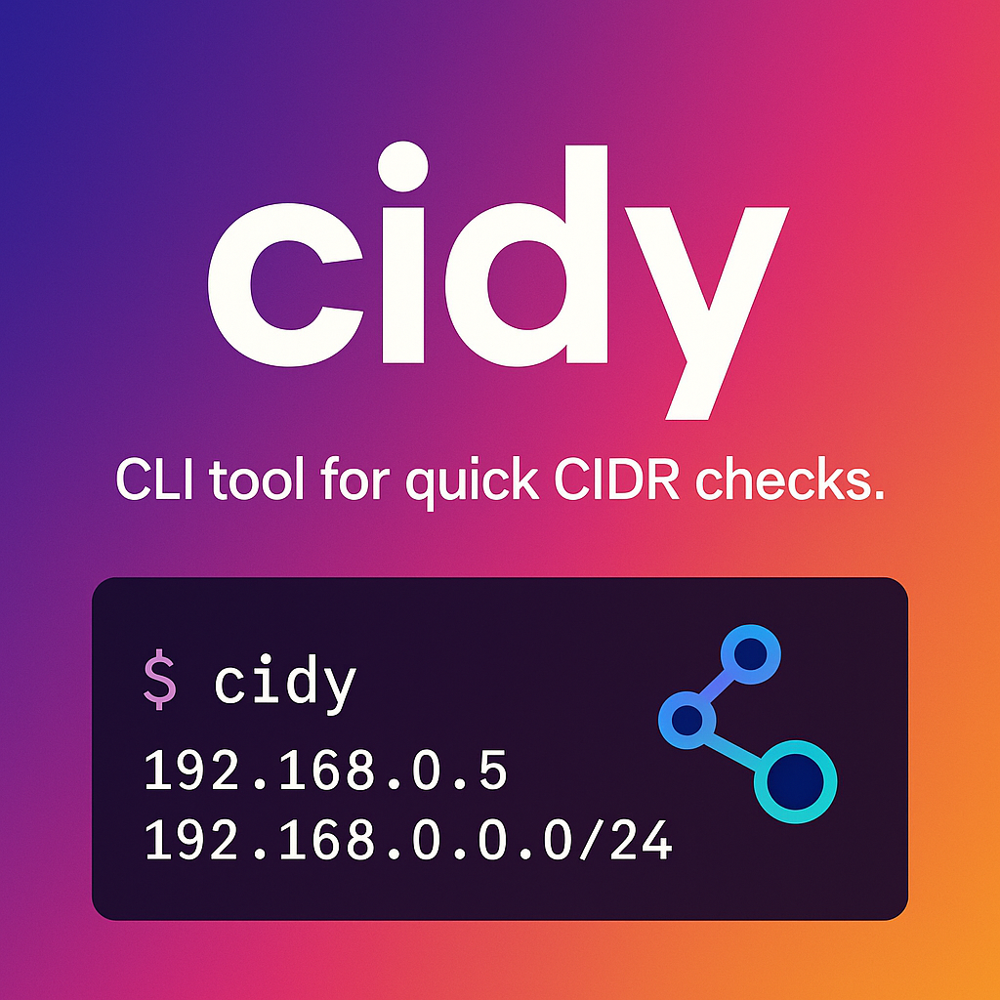

A simple CLI tool for checking if an IP address belongs to a given CIDR range.  
Supports single IP check, batch check from file, and JSON output.

## Features

- Check if a single IP address is within a specified CIDR range.
- Batch check: verify multiple IP addresses from a file.
- Output results in plain text or JSON format.
- Designed for easy integration and extensibility.
- Written in Go, with modular internal packages.

## Installation

You need Go 1.22 or later.

```bash
git clone https://github.com/koooyooo/cidy.git
cd cidy
go build -o cidy
```

## Usage

### Check if an IP is in a CIDR range

```bash
./cidy check 192.168.0.5 192.168.0.0/24
# Output: true
```

### Batch check from a file

Each line in the file should contain a single IP address.

```bash
./cidy check -f iplist.txt 192.168.0.0/24
# Output example:
# 192.168.0.5: true
# 192.168.0.100: true
# 10.0.0.1: false
```

### Output as JSON

```bash
./cidy check --json 192.168.0.5 192.168.0.0/24
# Output: {"ip":"192.168.0.5","cidr":"192.168.0.0/24","match":true}
```

### Show CIDR range information (planned)

```bash
./cidy info 192.168.0.0/24
```
*This feature is planned for future releases.*

## Command Reference

- `check`: Check if an IP address (or addresses from a file) is within a CIDR range.
  - `-f, --file <file>`: Specify a file containing IP addresses (one per line) for batch checking.
  - `--json`: Output the result in JSON format.
- `info`: (planned) Show information about a CIDR range (broadcast address, host range, etc.)

## Directory Structure

```
cidy/
├── cmd/                  # CLI command implementations (using cobra)
│   └── check.go
├── internal/             # Internal packages (not exposed outside this module)
│   └── fileutil/         # File utility functions for reading IP lists, etc.
│       └── fileutil.go
├── main.go               # Entry point
├── go.mod, go.sum        # Go module files
└── README.md
```

## Development

- The `internal/fileutil` package provides file reading and batch checking utilities.
- The `cmd` package implements CLI commands using [spf13/cobra](https://github.com/spf13/cobra).
- The code is organized to separate CLI logic and utility logic for maintainability.

## License

This project is licensed under the MIT License. See [LICENSE](LICENSE) for details.
